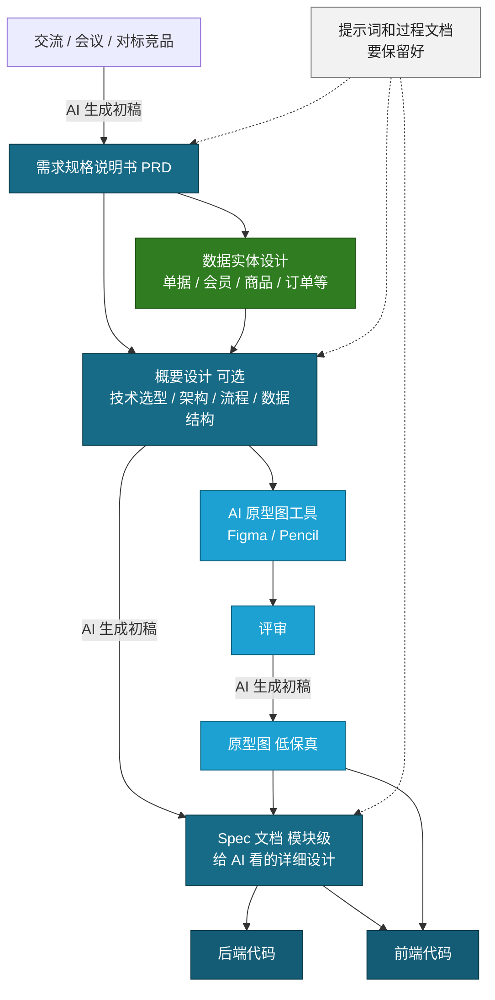

# 第六章：Spec Coding 开发模式

## 6.1 什么是 Spec Coding

Spec Coding 可以理解为：先把需求、原型、数据结构和技术方案整理成一份给 AI 看的详细说明书，再让 AI 按照说明书写代码。

它和直接说"帮我写一个系统"最大的区别是：

- 不是让 AI 自由发挥
- 而是让 AI 按照 PRD、原型图、概要设计和 Spec 文档逐步实现

Spec 文档就是 AI 编码前的"施工图"。

## 6.2 Spec Coding 流程图



## 6.3 流程讲解

第一步：从交流、会议、竞品分析中整理 PRD。

这一阶段主要解决"要做什么"。可以让 AI 根据会议记录、口头需求或竞品截图生成 PRD 初稿，然后由人来确认业务范围。

第二步：补充数据实体设计。

如果是业务系统，必须先想清楚核心数据对象，例如单据、会员、商品、订单、学生、班级等。数据实体不清楚，后面的接口和页面都会乱。

第三步：生成概要设计。

概要设计可以是可选步骤，但复杂项目建议保留。它主要说明技术选型、系统架构、业务流程和数据结构。概要设计不用特别细，但要给后面的 Spec 文档定方向。

第四步：使用 Figma、Pencil 等工具生成低保真原型图。

原型图解决"页面长什么样"。生成后一定要评审，重点看页面是否完整、字段是否遗漏、按钮操作是否合理。

第五步：生成模块级 Spec 文档。

Spec 文档要比 PRD 更接近代码。它要写清楚某个模块的页面结构、接口字段、业务规则、异常处理、文件规划和验收标准。

第六步：让 AI 按 Spec 生成代码。

后端代码主要参考数据实体、接口规则和业务规则。前端代码主要参考原型图、页面结构和接口约定。

## 6.4 Spec 文档最少要写什么

不需要把 Spec 写得特别复杂，可以要包含下面几项：

| 内容     | 说明                             |
| -------- | -------------------------------- |
| 模块目标 | 这个模块解决什么问题             |
| 页面范围 | 包含哪些页面或弹窗               |
| 数据实体 | 主要表、字段、状态               |
| 接口约定 | 请求地址、请求方式、参数、返回值 |
| 业务规则 | 校验、状态流转、权限、异常处理   |
| 文件规划 | 前端、后端分别修改哪些文件       |
| 验收标准 | 怎么判断功能完成                 |

一句话总结：

```text
PRD 给人看，概要设计给人看，原型图给人和 AI 看，Spec 主要给 AI 写代码看。
```

## 6.5 结合 Skill 提升 Spec Coding 效率

在第七章中我们会详细讲解 Skill 的应用。Skill 是把经验和流程沉淀下来的"专业操作手册"，Spec Coding 和 Skill 天然就是一对好搭档。

可以把 Spec Coding 中反复出现的流程封装成 Skill：

- **PRD 生成 Skill**：按照固定模板输出需求规格说明书
- **数据实体设计 Skill**：根据业务描述自动梳理实体、字段、关系
- **Spec 文档生成 Skill**：输入模块名称和 PRD 内容，按标准格式输出 Spec 文档
- **原型图评审 Skill**：按检查清单逐项审查原型图的完整性和合理性

这样做的好处是：

- 每次开始新模块时，不需要重新解释 Spec 的格式和要求
- AI 输出更稳定，减少来回修正的次数
- 新人可以通过 Skill 快速上手 Spec Coding 流程
- 团队可以统一 Spec 文档的风格和粒度

实际使用时，建议先把最常用的流程（比如生成 Spec 文档）做成 Skill，跑通几次之后再逐步沉淀其他环节。

具体 Skill 的写法和示例，详见第七章。

## 6.6 注意事项

- 提示词要保留好，后面复盘和继续开发时还能用
- PRD 不清楚时，不要直接进入编码
- 原型图没有评审时，不要急着生成前端页面
- Spec 要按模块拆分，不要一个文档塞完整个大系统
- AI 每完成一个阶段，都要运行、检查、再继续下一阶段

## 6.7 总结

Spec Coding 的核心流程是：

```text
交流需求 -> PRD -> 数据实体设计 -> 概要设计 -> 原型图评审 -> Spec 文档 -> 前后端代码
```

越是复杂项目，越不能直接让 AI 写代码。

先把 PRD、原型图和 Spec 准备好，AI 写出来的代码才更稳定、更符合项目目标。